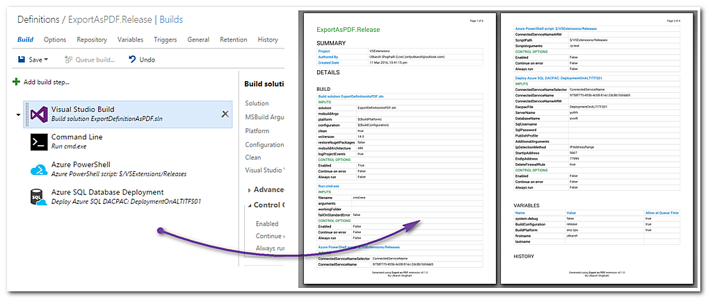
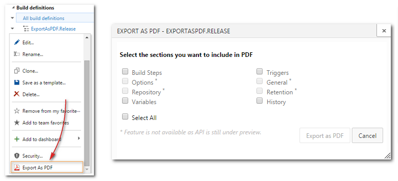

# Export As PDF #

Ever wanted to see all the details of your build definition including its steps, triggers, history etc in a neat report so that you can print it or share it with a colleague? Well, now you can. Just export the build definition as PDF and get everything printed in a neat report. No need to click individual build steps to see build step arguments, also no need to browse individual tabs to see triggers, history etc.

>[**Get it from Visual Studio Marketplace**](http://bit.ly/exportaspdf "Download")

## Get Started

> **Note:** The extension only supports new (non XAML) build definitions.

Once you install the extension, go to `Builds` hub and right-click on any build definition. You will see a new menu item `Export as PDF`. Click on it and you will be able to select what to include in the report. Chose the sections you want to be included in the PDF and click `Export as PDF`. The extension will scans your build definition, gets the details and generates the PDF which can be saved to your drive.

## What you can export?

You can export following properties of the build definition.

- Build steps
- Variables
- Triggers
- History

## Limitations/Known issues

Due to VSTS REST API still being in a `preview`, following build definition properties cannot be exported as of now. They will be supported in future versions of the extension.

- Options
- Repository information
- General tab

## Report Issues
Found an issue or want to suggest a feature? Add them at [http://bit.ly/exportaspdfissues](http://bit.ly/exportaspdfissues)

## Release notes
> **Jun 2016**
> - Fix: Extension breaks on TFS2015 Update 2 (on-prem).
> - Fix: Buttons on the dialog do not align properly.

> **Mar 2016**
> - Initial version (`preview`)
